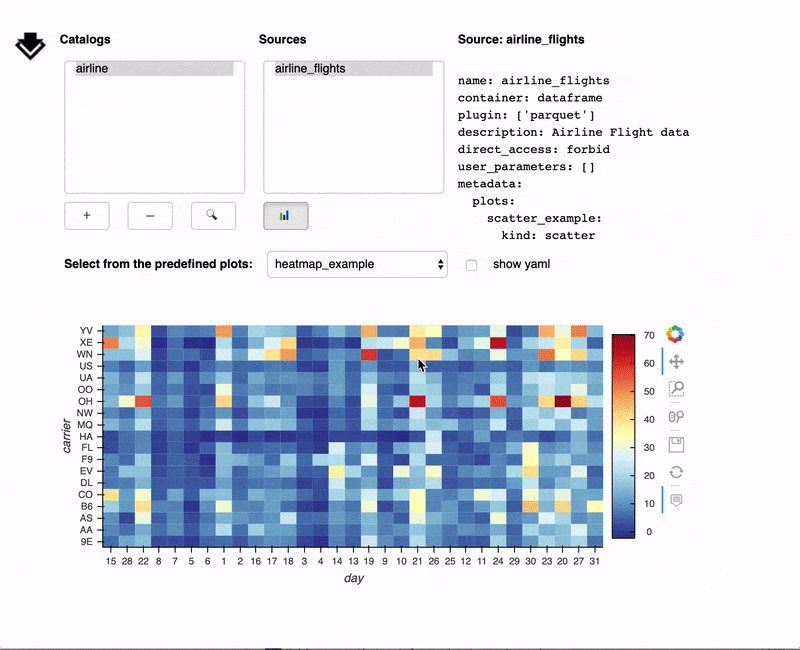
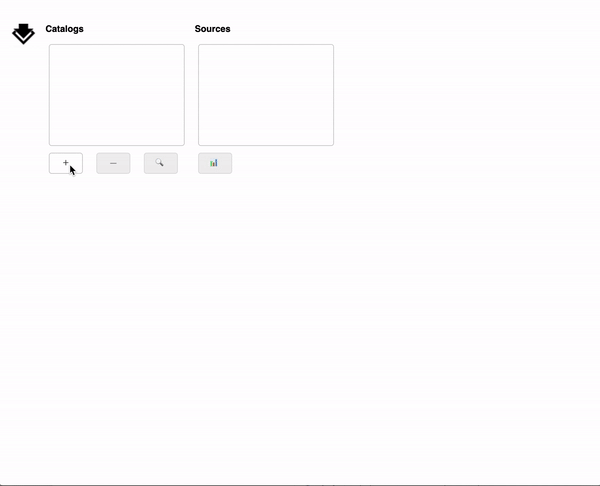
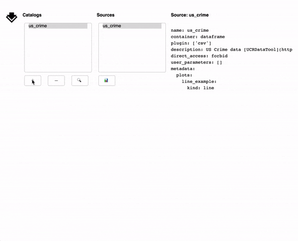

# Intake: Discovering and exploring data in a graphical interface



## Motivation
Do you have data that you'd like people to be able to explore on their own?
Are you always passing around snippets of code to load specific data files?
These are problems that people encounter all the time when working in groups
and using the same datasources or when trying to distribute data to the public.
Some users are comfortable interacting with data entirely programatically, but
often it is helpful to use a GUI (Graphical User Interface) instead. With that
in mind we have reimplemented the Intake GUI so that in addition to working in a
[jupyter notebook](https://jupyter.org/), it can be served as a web application
next to your data, or at any endpoint.

## What is Intake?
[Intake](https://intake.readthedocs.io) is a lightweight set of tools for
loading and sharing data. You might have seen earlier [blog posts](https://www.anaconda.com/?s=intake).
Intake separates the concepts of the *data engineer* - the person curating,
managing, and disseminating data - from the *data user* - the person analyzing
and visualizing the data. The data engineer sets up catalog files describing
data sources and the data user loads data without needing to know how it is
stored.

## Try it out
[](https://mybinder.org/v2/gh/intake/intake-examples/master?filepath=GUI.ipynb)

To use the GUI locally, pip/conda install intake and panel. Then run:

```bash
python -c "import intake; intake.gui.show()"
```

This command will open a browser tab containing a panel application (more
on this in the "How it Works" section)

If you'd rather work in the notebook open a notebook and run:

```python
import intake
intake.gui
```



## How to use it
Once you have a GUI, you can add and remove catalogs from the GUI using the +
and - buttons, select data sources from within catalogs, read the yaml that
those describes those sources. Use the plot button to see the pre-defined plots
that the data engineer has defined (if you would like to define some plots
see the [plotting docs](https://intake.readthedocs.io/en/latest/plotting.html))



For more information on how to interact with the new GUI, see the
[GUI docs](https://intake.readthedocs.io/en/latest/gui.html).

## How it works (hint: Panel!)
The intake GUI is built using the latest project in the [PyViz](https://pyviz.org)
ecosystem: [Panel](https://panel.pyviz.org). Panel provides a composable dashboarding
solution for displaying plots, images, tables, or text and widgets for interacting
with them. Panel works both in a Jupyter notebook and in a standalone secure web server
using the same source code.

From the data engineer perspective this means that you can serve the intake
GUI at an endpoint and use it as a data exploration tool for your data users. It
also means that it is straightforward to customize and reorganize the GUI to insert
your own logo, reuse parts of it in your own applications, or add new functionality.

## What's next
We have ambitious plans for the future of this GUI. In the near future,
we anticipate adding a mechanism for inputting user parameters, adding
some basic custom plotting, and allowing the editing and saving of catalogs.
See [GH#225](https://github.com/intake/intake/issues/225) for a full discussion
of the vision.
