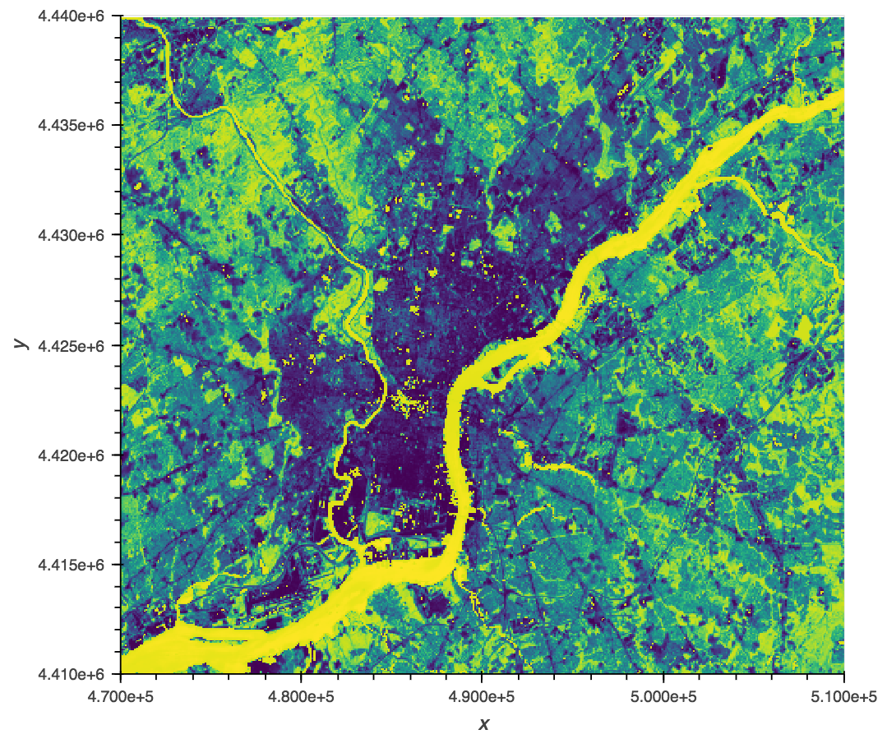

# Intake: Parsing data from filenames and paths
## Motivation
Do you have data in collections of files, where information is encoded both in
the contents and the file/directory names? Perhaps something like
`'{year}/{month}/{day}/{site}/measurement.csv'`? This is a very common problem for
which people build custom code all the time. Intake provides a systematic way
to declare that information in a concise spec.

## What is Intake?
[Intake](https://intake.readthedocs.io) is a lightweight set of tools for
loading and sharing data. You might have seen earlier blog posts
[introducing Intake](https://www.anaconda.com/blog/developer-blog/intake-taking-the-pain-out-of-data-access/)
 and [describing caching](https://www.anaconda.com/blog/developer-blog/intake-caching-data-on-first-read-makes-future-analysis-faster/).
Intake separates the concepts of the *data engineer* - the person curating,
managing, and disseminating data - from the *data user* - the person analyzing
and visualizing the data. The data engineer sets up catalog files describing
data sources and the data user loads data without needing to know how it is
stored. Intake makes creating functionality easy. Here we show new
functionality for dealing with structured file-names.

## How to use it - data user
Intake abstracts away messy data storage practices so data users
don't need to know about it. You get a full dataset from all the files,
together with the information from the filenames, in just two lines of code:

```
cat = intake.load_catalog('catalog.yml')
data = cat.data_source().read()
```

As an example we'll use a catalog with real satellite imagery data from 
the [landsat project](https://landsat.usgs.gov/landsat-project-description) 
to calculate Normalized Difference Vegetation Index ([NDVI](https://earthobservatory.nasa.gov/Features/MeasuringVegetation/measuring_vegetation_2.php)):

[](https://jsignell.github.com/intake-blog/path-as-pattern/ndvi_plot.html "Click on image for interactive version")

Click the button below to launch an interactive session of the example 
or download the notebook [here](https://jsignell.github.com/intake-blog/path-as-pattern/landsat.ipynb).

[](https://mybinder.org/v2/gh/jsignell/intake-blog/master?filepath=path-as-pattern%2Flandsat.ipynb)

## How to use it - data engineer
When loading multiple files, the locations of the files can often be provided
as a list or as a glob (a path containing `"*"` wildcards). For instance, let's
suppose that we have a number of CSV files containing precipitation forecasts
for a number of models run under different emissions scenarios. Each forecast
is stored in one file with the model and emissions scenario encoded in the
filename. The following glob pattern would match all of the files:

```
urlpath: 'data/SRLCC_*_Precip_*.csv'
```

In order to capture the data encoded into the names of the files, we can replace
the `"*"` wildcards with field-names, as follows, making what we'll refer to
as a path *pattern*:

```
urlpath: 'data/SRLCC_{emissions}_Precip_{model}.csv'
```

When the data source is opened, the values for each declared field are
populated from the path or filename and returned on the data.

When passing an explicit list of paths, the argument *path_as_pattern* can
be used to pass the *pattern* we want applied to the filenames:

```
urlpath:
  - 'data/SRLCC_a1b_Precip_ECHAM5-MPI.csv'
  - 'data/SRLCC_b1_Precip_PCM-NCAR.csv'
path_as_pattern: 'SRLCC_{emissions}_Precip_{model}.csv'
```

In this case the *pattern* is used to populate new columns (`emissions`
and `model`) on the data with the values for each set of data being populated
from the paths. Note that the *pattern* can just be a piece of the path as
long as it is unambiguous where the piece starts and stops. For instance,
`'{emissions}_Precip_{model}'` would not yield the intended
outcome since `emissions` would match everything before `'_Precip_'`
(`'data/SRLCC_b1'`) and  `model` would match everything after
(`'PCM-NCAR.csv'`).

Click the button below to launch an interactive example of setting up a
catalog with *path_as_pattern* or download the notebook [here](https://jsignell.github.com/intake-blog/path-as-pattern/csv.ipynb).

[](https://mybinder.org/v2/gh/jsignell/intake-blog/master?filepath=path-as-pattern%2Fcsv.ipynb)

## How it works
The formatting of the *pattern* is python [format string
syntax](https://docs.python.org/3.7/library/string.html#format-string-syntax)
, but inverse: the set of arguments required such that
``pattern.format(**arguments) == path``.

The logic is implemented in the function `intake.source.utils.reverse_format`,
which we can use to demonstrate how this works. We'll call
this function directly to demonstrate that any (reasonable) format string
syntax is supported and the parsed values will match the implied type of
the format string:

```python
>>> reverse_format('data_{year}_{month}_{day}.csv', 'data_2014_01_03.csv')
{'year': '2014', 'month': '01', 'day': '03'}
>>> reverse_format('data_{year:d}_{month:d}_{day:d}.csv', 'data_2014_01_03.csv')
{'year': 2014, 'month': 1, 'day': 3}
>>> reverse_format('data_{date:%Y_%m_%d}.csv', 'data_2016_10_01.csv')
{'date': datetime.datetime(2016, 10, 1, 0, 0)}
>>> reverse_format('{state:2}{zip:5}', 'PA19104')
{'state': 'PA', 'zip': '19104'}
```

## What's next
 - So far only the `CSV` plugin and `intake-xarray` plugin with `rasterio`
   driver support this behavior. More plugins can be made to respect
   `path_as_pattern` notation, using the helper classes provided in Intake.
   The specific implementation may depend on the specifics of the
   third-party library.
 - This feature seems most helpful in the context of multiple file loading,
   however, the functionality may also be useful for parsing other similarly
   structured text in general.
 - Add `regex` support for pattern as a path.
 - Swap out `reverse_format` for an external library such as [`parse`](http://pypi.python.org/pypi/parse).
